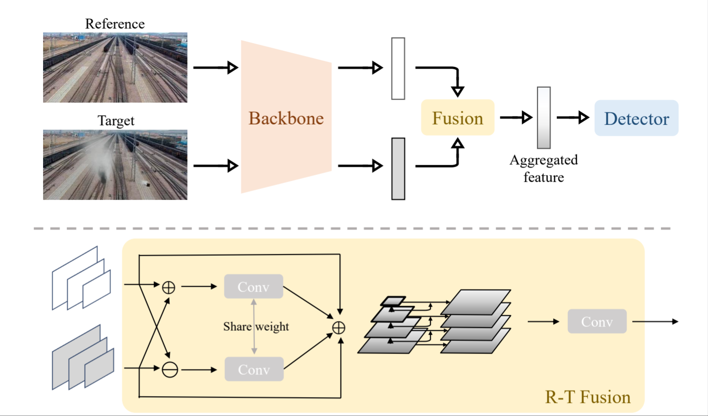
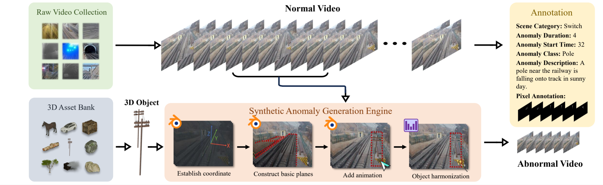

# WIDE: Make Railway Surveillance Anomaly Detection Right
This a repo of an official implement of paper "WIDE: Make Railway Surveillance Anomaly Detection Right".
<div align="center">
  
</div>


## 📁Data prepation
We introduce WIDE (RailWay surveillance vIdeo anomaly DEtection dataset), the first large and diverse dataset specifically designed for anomaly detection in railway surveillance. WIDE provides: (i) high-resolution video frames from 1080p to 2160p, (ii) synthetic anomalies generated using a physics engine to ensure realistic motion, and (iii) diverse environments featuring various lighting conditions.
<div align="center">
  
</div>

https://github.com/user-attachments/assets/6a61ad30-1218-409a-babd-905b8ab6367d

Download the WIDE dataset on [here](https://www.google.com.hk/search?q=%E6%8F%92%E5%85%A5pdf+github+readme&oq=%E6%8F%92%E5%85%A5pdf+github+readme&gs_lcrp=EgZjaHJvbWUyBggAEEUYOdIBCTEwMzAxajBqN6gCCLACAQ&sourceid=chrome&ie=UTF-8).

```
├── data
│   ├── train
│   │   ├── images
│   │   ├── masks
│   └── PC59
│       ├── images
│       └── masks
```
## 🛠️Installation
```
pip install -r requirements.txt
```

## 🚀Quick Start
```
python3 -m torch.distributed.launch --nproc_per_node=2 --use_env src/train.py --train-dataset Railway --test-dataset Railway --data-cv 0 --input-size 1333 --model resnet50_mtf_msf_fasterrcnn --mtf iade --msf 4 --warmup --loss bi -b 2 --e 15
```
